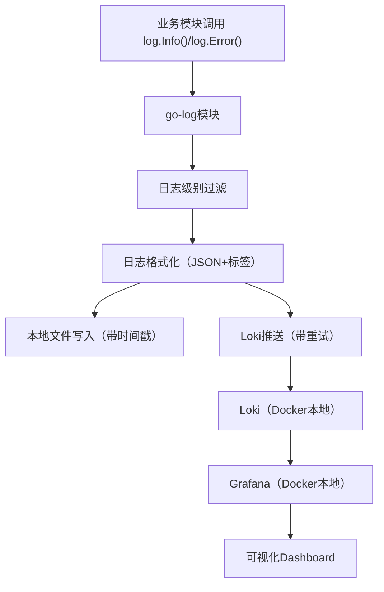

# go-log 日志归口模块

## 项目简介
本项目为 Go 语言开发的日志归口模块，支持本地日志文件和 Loki 日志系统双写，结合 Grafana 实现日志的可视化和分析。业务模块只需简单引用 pkg/log 包，调用日志打印方法即可自动将日志本地备份并上报到 Loki，无需关心底层实现。

## 功能特性

### 🚀 核心功能
- **多级别日志**: 支持 DEBUG、INFO、WARN、ERROR 四个级别
- **双写机制**: 同时写入本地文件和 Loki 系统
- **自定义标签**: 支持业务自定义标签，便于日志分类和检索
- **结构化日志**: 使用 JSON 格式，支持任意字段扩展
- **级别过滤**: 根据配置的日志级别自动过滤输出

### 🔧 技术特性
- **重试机制**: Loki 推送失败时自动重试（最多3次）
- **并发安全**: 使用 mutex 保证多协程安全
- **错误处理**: 完善的错误处理和日志记录
- **时间戳**: 纳秒级时间戳，满足高精度要求
- **缓冲刷新**: 本地文件实时刷新，确保日志不丢失

## 架构流程


## 快速开始

### 1. 本地部署 Loki + Grafana

1. 确保已安装 Docker 和 docker-compose
2. 在项目根目录启动服务：
```bash
docker-compose up -d
```
3. 访问 Grafana: http://localhost:3000（默认用户名/密码：admin/admin）
4. 在 Grafana 添加 Loki 数据源，地址：http://loki:3100

### 2. 引入 go-log 模块

在你的 Go 项目中引入模块：
```go
import "logdashboard/pkg/log"
```

### 3. 初始化配置

```go
log.Init(log.Config{
    Level:    "info",                    // 日志级别: debug, info, warn, error
    FilePath: "/var/log/myapp.log",      // 本地日志文件路径
    LokiURL:  "http://localhost:3100/loki/api/v1/push", // Loki推送地址
    Labels: map[string]string{
        "service":    "myapp",
        "env":        "production",
        "version":    "1.0.0",
        "component":  "api",
        "datacenter": "us-east-1",
    },
})
```

### 4. 使用示例

```go
// 基本日志记录
log.Info("用户登录成功")

// 带字段的日志
log.Info("用户登录", 
    log.NewField("user_id", "12345"),
    log.NewField("username", "alice"),
    log.NewField("ip", "192.168.1.100"),
)

// 不同级别的日志
log.Debug("调试信息", log.NewField("debug_flag", true))
log.Warn("警告信息", log.NewField("threshold", 90))
log.Error("错误信息", log.NewField("error", err.Error()))
```

## 配置说明

### Config 结构体
| 字段     | 类型              | 说明                                    | 示例                                 |
|----------|-------------------|-----------------------------------------|--------------------------------------|
| Level    | string            | 日志级别（debug/info/warn/error）       | "info"                               |
| FilePath | string            | 本地日志文件路径                        | "/var/log/myapp.log"                 |
| LokiURL  | string            | Loki 推送地址                           | "http://localhost:3100/loki/api/v1/push" |
| Labels   | map[string]string | 日志自定义标签                          | {"service": "myapp", "env": "prod"}  |

### 日志级别说明
- **debug**: 调试信息，开发阶段使用
- **info**: 一般信息，记录程序正常运行状态
- **warn**: 警告信息，程序可以继续运行但需要注意
- **error**: 错误信息，程序遇到错误但可以继续运行

## API 文档

### 初始化函数
```go
func Init(c Config)
```
初始化日志系统，必须在使用日志功能前调用。

### 日志记录函数
```go
func Debug(msg string, fields ...Field)
func Info(msg string, fields ...Field)
func Warn(msg string, fields ...Field)
func Error(msg string, fields ...Field)
```

### 字段构造函数
```go
func NewField(key string, value interface{}) Field
func FieldFunc(key string, value interface{}) Field  // 向后兼容
```

## 完整示例

查看 `example/main.go` 文件获取完整使用示例：

```bash
# 运行示例
cd example
go run main.go
```

## 测试

运行测试用例：
```bash
# 运行单元测试
go test ./pkg/log

# 运行端到端测试
./test_end2end.sh
```

## Grafana 使用指南

### 1. 配置数据源
- 访问 Grafana (http://localhost:3000)
- 添加 Loki 数据源: http://loki:3100

### 2. 常用查询语句
```logql
# 查看所有日志
{service="myapp"}

# 按级别过滤
{service="myapp", level="error"}

# 按环境过滤
{service="myapp", env="production"}

# 复合查询
{service="myapp", env="production"} |= "error"

# 时间范围查询
{service="myapp"} | json | level="error" | __timestamp__ >= "2023-01-01T00:00:00Z"
```

### 3. Dashboard 建议
推荐创建以下 Dashboard：
- **日志总览**: 显示各级别日志数量趋势
- **错误监控**: 专门监控错误日志
- **性能分析**: 分析响应时间相关日志
- **用户行为**: 分析用户操作日志

## 生产环境部署

### 1. 安全建议
- 使用 HTTPS 连接 Loki
- 配置访问认证
- 限制日志文件大小和保留期

### 2. 性能优化
- 设置合适的日志级别
- 使用日志轮转（logrotate）
- 监控磁盘使用情况

### 3. 高可用部署
- 部署多实例 Loki
- 配置负载均衡
- 设置数据备份策略

## 故障排除

### 1. 常见问题
- **Loki 连接失败**: 检查网络连接和 Loki 服务状态
- **日志文件写入失败**: 检查文件权限和磁盘空间
- **日志丢失**: 检查日志级别配置

### 2. 调试方法
```go
// 临时启用 debug 级别查看详细信息
log.Init(log.Config{
    Level: "debug",
    // ... 其他配置
})
```

## 扩展功能

### 计划中的功能
- 日志切割与归档
- 异步写入与缓冲
- 多种输出格式支持
- 性能指标监控
- 自动标签补全

### 贡献指南
欢迎提交 Issue 和 Pull Request！

## 许可证
MIT License

---

如有问题或建议，请联系维护者。 